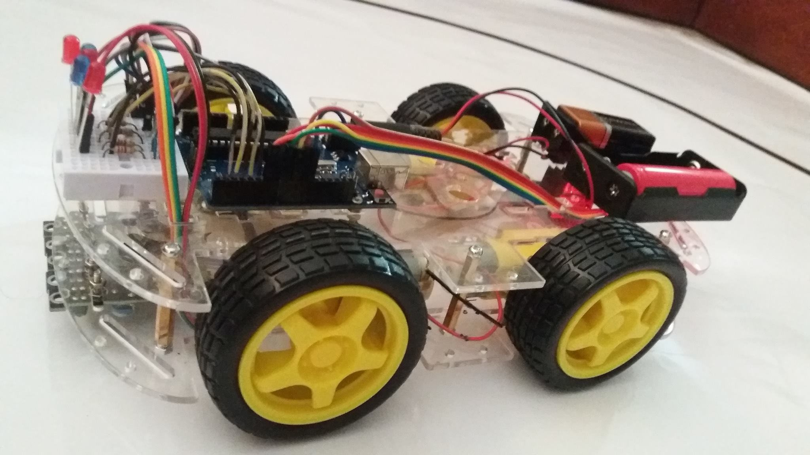
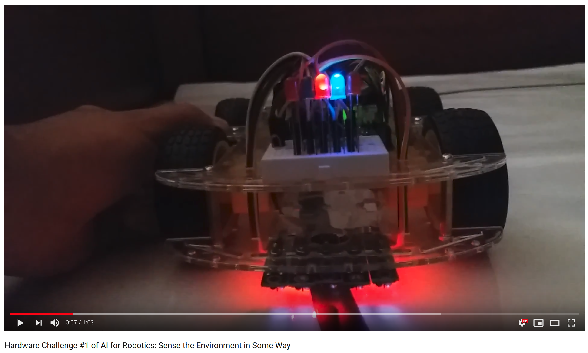
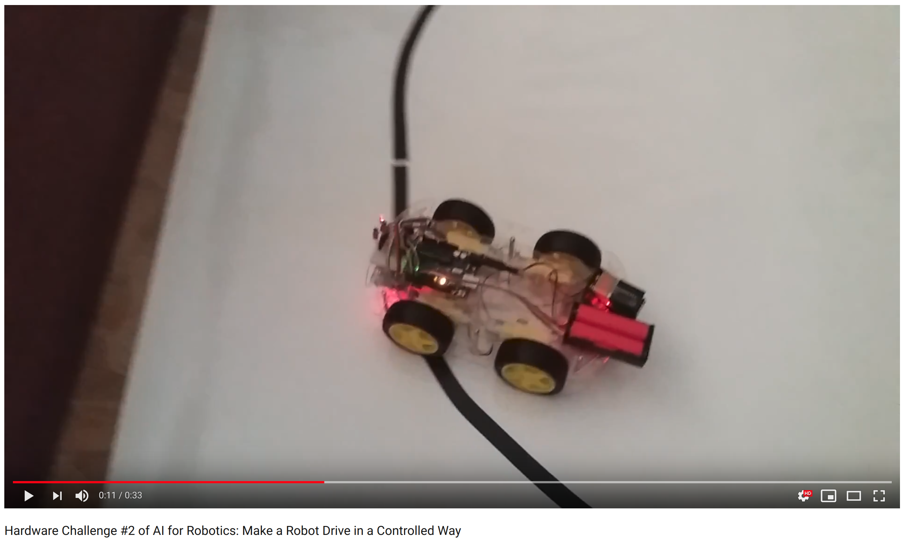
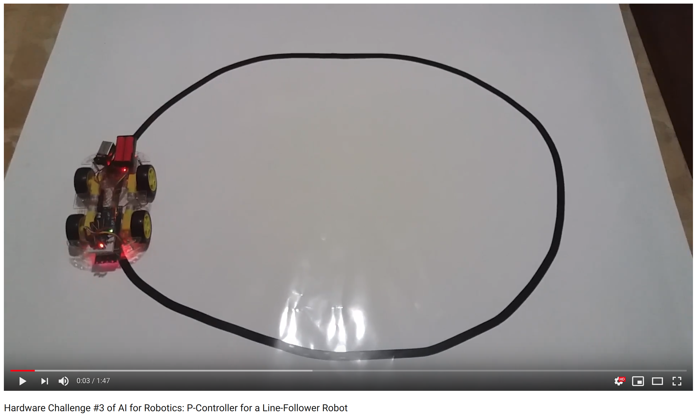

# Line Follower Robot

**Hardware Challenge #0 of AI for Robotics**
Acquire Some Hardware and Describe It

I bought all the electronic parts necessary to build a line-follower robot:
* 1 transparent chassis of plastic
* 4 motors
* 4 wheels
* L298N motor driver board 
* ARDUINO UNO
* 5 TCRT5000 infrared tubs
* 5 LEDs
* 5 resistors
* 1 mini protoboard
* 2 battery boxes
* 3 batteries
* 1 USB cable for Arduino
* Cables, screws and bolts

**Hardware Challenge #1 of AI for Robotics**
Sense the Environment in Some Way
By using 5 TCRT5000 infrared tubs, I sense the presence of black lines and white floor below the line-follower robot. Each TCRT5000 module has its own electronic circuit, for a total of 5 TCRT5000 e-circuits. Each TCRT5000 e-circuit has a resistor, a LED, a TCRT5000 module, and 3 cable connections: Ground, +5V, and the signal sent to the LED and to the analog inputs of Arduino. The TCRT5000 signal has input voltages between 0 and 5 volts and is mapped into integer values between 0 and 1023, by using the Arduino function analogRead(). In practice, a black line is transduced into an integer value of 400 and white floor is transduced into an integer value of 20, approximately. The sensitivity of each TCRT5000 module can be adjusted by using a small screwdriver to tune the regulator. These integer values of transduction reflect the proportional voltages shown in the LEDs. So, a black line turns the LEDs on and the white floor turns the LEDs off, as shown in the video. The 5 TCRT5000 e-circuits are only the perceptual part of the line-follower robot. In the Hardware Challenge #3, I will explain how these integer values of transduction will be used to produce intelligent behavior, to make the robot follow the black line.

Video Demonstration:

https://youtu.be/YxFP9dMudcE

**Hardware Challenge #2 of AI for Robotics**
Make a Robot Drive in a Controlled Way
In this project, I ensure that all the connections and pins of the "L298N dual H-bridge DC motor driver board" are correctly configured and programmed from the Arduino board. So that, the robot can move forwards, move backwards, turn in both directions, brake, and modulate its speed at will, as shown in the video. 
If you read the L298N dual H-bridge DC motor driver board manual, you will find a brief explanation of how the L298N module works. The pins ENA and ENB can be controlled via the PWM pins of Arduino to regulate the speed of motor A and motor B, respectively. Motor A goes forwards when Arduino sets IN1 to 5V and IN2 to GND. And it goes backwards when Arduino sets IN1 to GND and IN2 to 5V. Motor B goes forwards when Arduino sets IN3 to 5V and IN4 to GND. And it goes backwards when Arduino sets IN3 to GND and IN4 to 5V. However, motor A and motor B are placed in opposite directions. So, their logic must be also inverted. The robot stops when IN1, IN2, IN3, and IN4 are set to 5V.
Moreover, motor A and motor B are double motors. We have 4 motors instead of 2 motors. And the L298N module only has 2 motor controllers. So, each pair of motors must be electrically correlated in the correct way. And the correct way means the cables must be connected in an inverted and parallel way because the motors in each side of the robot are placed in opposite directions. Such electrical correlation produces a curious phenomenon. Each pair of motors in each side gets electrically and mechanically correlated. If 12V are fed into 1 pair of motors, both motors move in the same direction. That's expected. And if you move 1 motor with your hand, the solenoid generates electricity like a dynamo (electricity generator), moving the other electrically correlated motor in the same direction but in a slower way. That's the curious part.
Now that the electronic parts were bought (Hardware Challenge #0), the sensors can transduce the world (Hardware Challenge #1), and the motors produce coherent movements controlled by Arduino commands (Hardware Challenge #2), the design and implementation of the line-follower robot can be explained (Hardware Challenge #3).

Video Demonstration:

https://youtu.be/lya-ddb5DFg

**Hardware Challenge #3 of AI for Robotics**
P-Controller for a Line-Follower Robot

The previous Hardware Challenges explained the electronic parts bought (Hardware Challenge #0), how the robot sees the black line and the white floor (Hardware Challenge #1), and how the robot moves in a coherent way according to Arduino commands (Hardware Challenge #2). These are the prerequisites to explain how to build a P-controller for a line-follower robot.

Basically, the integer values of transduction are simplified even further by classifying them into 2 bins: 0 (low values) and 1 (high values). There are 5 TCRT5000 modules. Each TCRT5000 module has an associated semantics, the variable line. Line adds -4, -2, 0, 2, and 4 if the corresponding TCRT5000 modules are active. Then line is divided by the number of active TCRT5000 modules because many TCRT5000 modules can be active at once. For example, 1 or 2 TCRT5000 modules can be active at once. So, the resulting line value is in the range [-4, 4], only integer values are allowed. If the line value is 0, it means the robot is on track without deviation. Higher absolute values of line means the robot is deviated and motors must turn the robot in PROPORTION to the variable line.

The Arduino loop has 2 modes of operation:

Mode 1: When 1 or 2 TCRT5000 modules are active at once, it means the robot is not so deviated can correct its course by making small PROPORTIONAL adjustments to its position by slowing down one motor at the corresponding side. The command digitalWrite(LED_BUILTIN, HIGH) is executed to visualize this mode.

Mode 2: When no TCRT5000 modules or all TCRT5000 modules are active, it means the robot is seeing background without line. So, the robot must turn around its own position to the last seen value of the variable line and make no further advancements. That is, the robot must turn its wheels by activating the pairs of motors in opposite directions. The command digitalWrite(LED_BUILTIN, LOW) is executed to visualize this mode.

The integral part and the derivative part of the PID controller were not required for this project. The integral part was not required because this robot has no drift. The derivative part was not required because the robot shows no oscillations in its movements. Proportional adjustments are small enough to avoid oscillations and frequent enough to keep the robot on track.

Video Demonstration:

https://youtu.be/DaOiyH9NtPE
